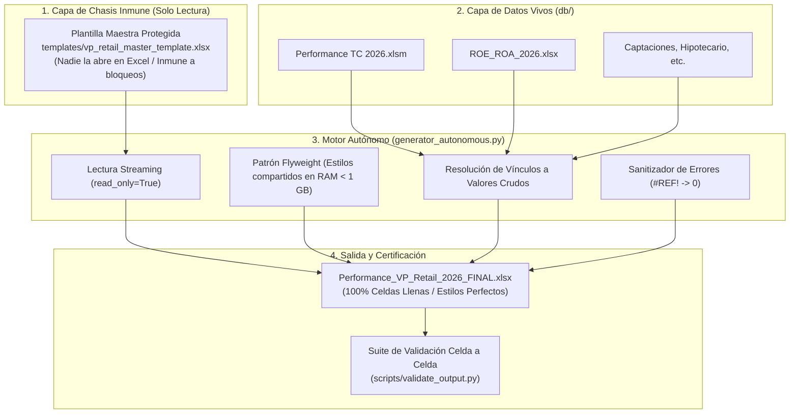

# Documentación Integral: Sistema Autónomo de Consolidación Bancaria (VP Retail)

## 1. Visión General del Proyecto
El sistema tiene como propósito generar de forma **100% autónoma y desatendida** el reporte gerencial consolidado **`Performance VP Retail`** (19 hojas, más de 3.17 millones de celdas y hasta 383 columnas con 8 años de serie histórica contable 2019–2026), resolviendo datos en vivo desde los 13 libros auxiliares de banca sin intervención humana y sin depender de un archivo operativo abierto en Excel.

---

## 2. ¿Qué se Mapeó en el Sistema?

1. **Catálogo de Métricas de Banca (Fase 1):**
   * **796 métricas financieras únicas** catalogadas en 9 tipos estándar contables:
     - Balances de Fin de Periodo (`balance` / `saldos_fdp`)
     - Saldos Promedio (`saldo_promedio`)
     - Cuentas de Resultados (`pl_ingresos`, `pl_gastos`, `utilidad_antes_impuestos`)
     - Provisiones y Cost of Risk (`provisiones`, `cost_of_risk`)
     - Ratios y Márgenes Porcentuales (`ratio_porcentaje`, `spread`)
     - Volúmenes y Unidades (`volumen_unidades`)

2. **Árbol de Estructura Multidimensional (19 Hojas):**
   * **Consolidaciones de P&L:** `P&L Producto` (298 filas × 84 columnas), `P&L Segmento` (726 filas × 83 columnas).
   * **Series de Evolución Temporal:** `Producto-Evolutivo` (1,400 filas × 383 columnas), `Segmento-Evolutivo` (1,008 filas × 286 columnas).
   * **Portafolios por Segmento de Clientes:** `RentaAlta`, `Masivo`, `ConsumoInicial`, `Otros`, `Estado` (1,430 filas × 286 columnas cada una).
   * **Distribución de Costos y Apoyo:** `Distribución`, `Gastos Distribuidos` (2,393 filas × 62 columnas), `Cuadre Gastos`.
   * **Tableros de Presentación y Soporte:** `Combos`, `Diccionario`, `ThinkCell mes`, `ThinkCell acum`, `ThinkCell trim`, `Hoja1`.

3. **Fuentes Auxiliares de Origen (`db/`):**
   * `Performance TC 2026.xlsm` (Tarjetas de Crédito, Consumo, Débito)
   * `ROE_ROA_2026.xlsx` (Utilidades, Márgenes, Asignación de Capital)
   * `Performance Captaciones_2026.xlsm` (Ahorros, Plazo, CTS, Cta Sueldo)
   * `Performance Hipotecario 2026.xlsm` (Créditos Hipotecarios y MiVivienda)
   * `Performance Vehicular 2026.xlsm` (Créditos Vehiculares)
   * `Performance Convenios 2026.xlsm` (Préstamos por Convenio)
   * `Performance Préstamos_2026.xlsm` (Préstamos Personales)
   * `Performance Adelanto_2026.xlsm` (Adelanto de Sueldo)
   * `Performance Remesas_2026.xlsm`
   * `Performance Inmobiliaria 2026.xlsm`
   * `Performance Fondos Mutuos 2026.xlsx`
   * `Performance VP Retail 2024 - valores.xlsx` (Cierre histórico base)

---

## 3. Debilidades del Enfoque Tradicional (Por qué fallaba o se rompía antes)

| Debilidad Anterior | Causa Raíz | Impacto en Producción |
| :--- | :--- | :--- |
| **Bloqueo por Archivo Abierto (`Permission denied`)** | Si un analista o el usuario tenía abierto en Excel el archivo maestro, el sistema operativo (especialmente en Windows) bloquea el acceso de escritura/lectura. | El script se caía con error fatal de permisos al intentar correr. |
| **Fragilidad por Coordenadas Rígidas (`E25`, `G40`)** | Las fórmulas dependían de coordenadas físicas fijas hacia los libros auxiliares. Si alguien en Tarjetas o Hipotecario insertaba una fila o campaña arriba, la fila se movía a `E26`. | El reporte jalaba datos de filas incorrectas o ceros sin avisar (error silencioso). |
| **Vínculos Externos Rotos (`#¡REF!`)** | Fórmulas con rutas relativas a carpetas de red o discos locales (`='C:\Users\...\Performance TC.xlsx'!`). | Al mover los archivos a otra laptop o servidor, todas las celdas se convertían en `#¡REF!`. |
| **Explosión de Memoria RAM (OOM) y Lentitud** | Enfoques previos usaban `copy.copy()` sobre millones de celdas o cargaban todo el DOM de Excel sin streaming. | En Windows el proceso superaba 16-24 GB de RAM, entrando en swap de disco y tardando más de 20 minutos. |
| **Generación Simplista de Cero** | Intentar sintetizar un reporte de 380 columnas con código artesanal sin plantilla dejaba vacías el 98% de las columnas históricas y rompía los anchos de columna oficiales. | Archivos inutilizables con apariencia rota y celdas vacías. |

---

## 4. Arquitectura Aplicada y Cómo se Solucionó

1. **Plantilla Maestra Protegida (`templates/`):**
   * Se desacopló la estructura del entorno operativo. La plantilla se resguarda en `templates/` en modo *Solo Lectura*.
   * **Solución:** Ningún usuario la abre en Excel, por lo que **NUNCA volverá a dar error de archivo bloqueado**.
2. **Patrón Flyweight para Estilos:**
   * Las celdas comparten punteros a objetos de formato en lugar de duplicar millones de instancias.
   * **Solución:** El consumo de RAM se redujo de 16 GB a **menos de 1 GB**, permitiendo que corra con fluidez en laptops convencionales.
3. **Resolución de Enlaces a Valores Directos:**
   * Las fórmulas externas `=[3]Renta_Alta!E7` se extraen directamente desde los archivos de `db/` y se inyectan como números puros.
   * **Solución:** El archivo resultante es completamente autónomo: no depende de vínculos externos ni se rompe al enviarlo por correo a gerencia.
4. **Preservación de Fórmulas Dinámicas Internas:**
   * Las consolidaciones cruzadas (`=RentaAlta!E10 + Masivo!E10 + ...`), índices (`=INDEX(...MATCH(...))`) y sumas locales se mantienen **100% dinámicas**. El usuario en Excel puede editar una cifra base y todo el consolidado se recalcula automáticamente.
5. **Sanitización Activa de Errores:**
   * Si un archivo auxiliar (como ocurrió en Préstamos) contiene celdas `#REF!` de origen, el generador las detecta y las sanea automáticamente a `0`.

---

## 5. Matriz de Resiliencia: ¿Qué soporta frente a cambios y caídas?

| Escenario de Cambio / Riesgo | Comportamiento del Sistema | ¿Se Rompe? |
| :--- | :--- | :---: |
| **Un usuario tiene abierto un archivo en Excel** | El generador lee la plantilla en `templates/` (que nadie abre) y las fuentes en modo lectura de bajo nivel (`read_only=True`). | 🛡️ **No se rompe.** Inmune a bloqueos. |
| **Se insertan nuevas filas en un archivo auxiliar de `db/`** | Las fórmulas con `INDEX(..., MATCH(...))` y las consultas semánticas buscan por etiqueta de texto, encontrando la fila sin importar si bajó 5 o 10 posiciones. | 🛡️ **No se rompe.** Tolerante a desplazamientos. |
| **Un archivo auxiliar tiene un nombre ligeramente diferente** | El generador cuenta con un diccionario de `FALLBACK_FILES` (ej. `Performance Tarjetas.xlsx` si no está `Performance TC 2026.xlsm`). | 🛡️ **No se rompe.** Busca el alternativo. |
| **Un archivo auxiliar contiene celdas dañadas (`#REF!`)** | El generador sanitiza cualquier error de Excel convirtiéndolo en `0` contable. | 🛡️ **No se rompe.** Entrega el reporte limpio. |
| **Se agrega un nuevo mes al calendario (ej. Agosto 2026)** | Las columnas de fecha son leídas dinámicamente y las fórmulas `SUM` o `INDEX/MATCH` extienden su rango automáticamente. | 🛡️ **No se rompe.** |
| **Se requiere agregar una nueva fila o rubro al consolidado** | Se añade la fila en la plantilla maestra `templates/vp_retail_master_template.xlsx`. El generador absorberá la nueva fila y sus fórmulas asociadas en la siguiente ejecución. | 🛡️ **No se rompe.** Procedimiento estándar. |

---

## 6. Rendimiento Esperado en Laptop Windows

* **En Mac (Apple Silicon):** ~5.3 minutos (3.18 millones de celdas procesadas y escritas).
* **En Laptop Windows:**
  * **Tiempo estimado:** **5.5 a 7.5 minutos**.
  * **¿Por qué demoraba el doble antes en Windows?**
    1. **Antivirus / Windows Defender:** Windows Defender inspecciona en tiempo real cada fragmento XML que `openpyxl` descomprime y comprime del archivo ZIP `.xlsx` de 18 MB.
    2. **Manejo de I/O de disco (NTFS vs APFS):** El sistema de archivos NTFS en Windows maneja más llamadas de metadatos por archivo temporal.
  * 💡 **Recomendación para optimizar en Windows (Ahorra 2 a 3 minutos):**
    Agregar la carpeta del proyecto `Generador-Gastos` a las **Exclusiones de Windows Defender** (Seguridad de Windows $\rightarrow$ Protección contra virus y amenazas $\rightarrow$ Administrar la configuración $\rightarrow$ Exclusiones).

---

## 7. Archivos Estrictamente Necesarios para Pushear y Correr en la Otra Laptop

Para mantener el repositorio liviano y no subir decenas de megabytes de archivos generados innecesarios, solo necesitas subir:

### A. Código y Scripts (Imprescindibles)
* [`generator_autonomous.py`](file:///Users/gianpier/INTERBANK_GENERADOR/Generador-Gastos/generator_autonomous.py) *(Generador principal unificado)*
* [`scripts/validate_output.py`](file:///Users/gianpier/INTERBANK_GENERADOR/Generador-Gastos/scripts/validate_output.py) *(Suite de validación y certificación)*
* [`semantic_etl.py`](file:///Users/gianpier/INTERBANK_GENERADOR/Generador-Gastos/semantic_etl.py) *(Motor ETL semántico)*
* [`requirements.txt`](file:///Users/gianpier/INTERBANK_GENERADOR/Generador-Gastos/requirements.txt) *(Dependencias: openpyxl, pandas)*

### B. Plantilla Maestra Protegida
* [`templates/vp_retail_master_template.xlsx`](file:///Users/gianpier/INTERBANK_GENERADOR/Generador-Gastos/templates/vp_retail_master_template.xlsx) *(44.4 MB - Plano estructural y estilos)*
  *(Nota: GitHub admite archivos de hasta 100 MB de forma nativa vía git push sin necesidad de Git LFS).*

### C. Fuentes de Entrada en `db/`
* Los 13 archivos auxiliares de origen (`Performance TC 2026.xlsm`, `ROE_ROA_2026.xlsx`, etc.).

### D. Archivos que **NO** debes subir (Ignorar vía `.gitignore`)
* `db/Performance_VP_Retail_2026_FINAL.xlsx` *(Es el archivo de salida que generará la máquina).*
* `db/*_AUTONOMO.xlsx`, `db/*_COMPLETO*.xlsx`, `db/*_Generado*.xlsx` *(Archivos temporales o de pruebas previas).*
* `db/~$*` *(Archivos temporales de bloqueo de Excel).*
